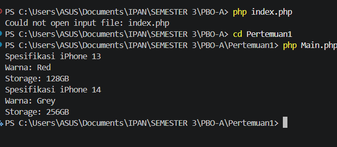
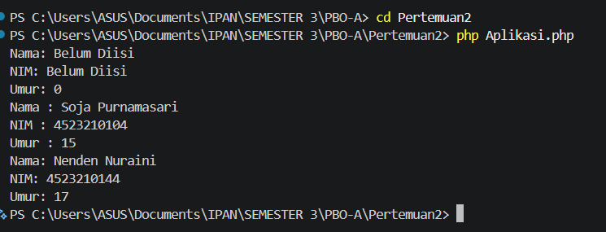
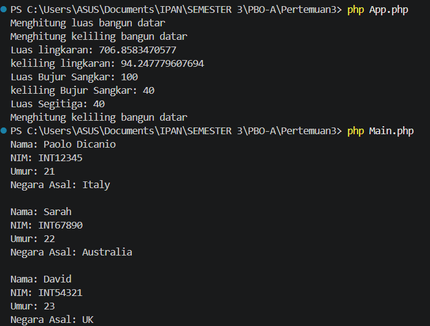
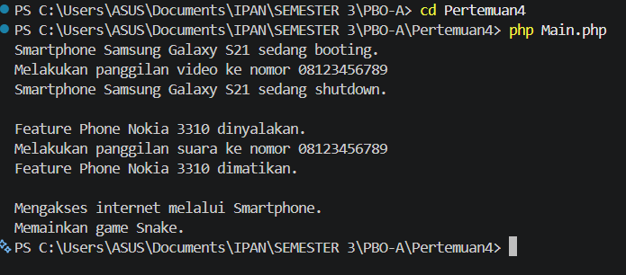
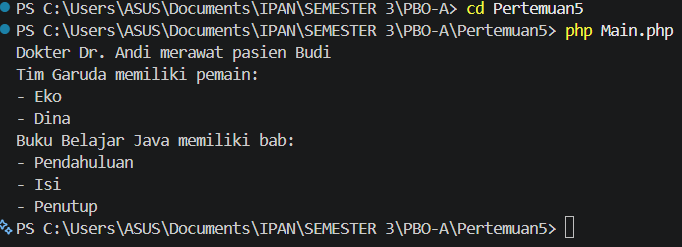
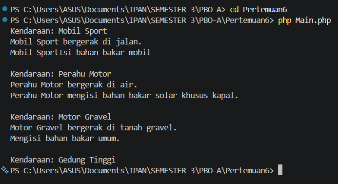

# Versi PHP

**Nama:** Irvan Indra Mustofa 
**NPM:** 4525210107

Folder ini berisi implementasi PHP dari contoh pemrograman berorientasi objek
di folder `versiJava`. Setiap folder membahas konsep yang sama, dengan kelas
dipisahkan ke berkas `.php` masing-masing.

## Cara menjalankan

1. Pastikan PHP sudah terpasang. Periksa melalui terminal:

   ```sh
   php --version
   ```

2. Buka terminal di folder proyek `Tugas1-PBO-A` (misalnya melalui **Terminal >
   New Terminal** di VS Code), lalu jalankan salah satu perintah berikut.
   Tanda kutip diperlukan karena beberapa nama folder mengandung spasi:

```sh
php "versiPHP/01 Class/Main.php"
php "versiPHP/02 Constructor/Aplikasi.php"
php "versiPHP/03 inheritance/App.php"
php "versiPHP/03 inheritance/Main.php"
php "versiPHP/04 polymorphism/Main.php"
php "versiPHP/05 asosiasikomposisi/Main.php"
php "versiPHP/06 abstractinterface/Main.php"
```

Jalankan satu perintah setiap kali untuk melihat output contoh tersebut.
Perintah-perintah ini juga dapat dijalankan dari folder `versiPHP` dengan
menghapus awalan `versiPHP/` dari path berkas.

`App.php` dan `Main.php` di folder `03 inheritance` adalah dua contoh terpisah:
`App.php` menjalankan contoh pewarisan bangun datar, sedangkan `Main.php`
menjalankan contoh pewarisan kelas mahasiswa.

## Gambar hasil setiap run

Gambar berikut menampilkan perintah terminal dan output dari masing-masing
contoh. Folder `03 inheritance` memiliki dua program utama, jadi keduanya
ditampilkan terpisah.

### 01 Class



### 02 Constructor



### 03 Inheritance — Bangun Datar



### 03 Inheritance — Mahasiswa


### 04 Polymorphism



### 05 Asosiasi, Agregasi, dan Komposisi



### 06 Abstract Class dan Interface



## Materi di setiap folder

| Folder | Konsep | Contoh utama |
| --- | --- | --- |
| `01 Class` | Kelas, objek, properti, constructor, dan getter | `Main.php` |
| `02 Constructor` | Nilai default constructor, parameter opsional, getter, dan setter | `Aplikasi.php` |
| `03 inheritance` | Pewarisan dan method overriding pada bangun datar serta mahasiswa internasional | `App.php`, `Main.php` |
| `04 polymorphism` | Pewarisan handphone, polymorphism, dan pemeriksaan tipe objek | `Main.php` |
| `05 asosiasikomposisi` | Asosiasi, agregasi, dan komposisi | `Main.php` |
| `06 abstractinterface` | Abstract class, interface, implementasi method, dan trait | `Main.php` |

## Padanan konsep Java di PHP

- PHP hanya memiliki satu constructor per kelas. Parameter opsional dipakai
  untuk meniru beberapa variasi constructor Java, seperti pada `Mahasiswa`.
- Interface PHP mendefinisikan kontrak method, tetapi tidak menyediakan
  default method seperti Java. Trait `FuelableDefault` digunakan pada contoh
  `Motor` untuk menyediakan implementasi `refuel()` yang dapat dipakai ulang.
- PHP menggunakan `extends` untuk pewarisan kelas, `implements` untuk
  implementasi interface, dan `instanceof` untuk memeriksa tipe objek.
- `require_once` memuat definisi kelas satu kali. `__DIR__` membuat jalur
  pemuatan berkas tetap mengacu pada lokasi berkas saat ini.
